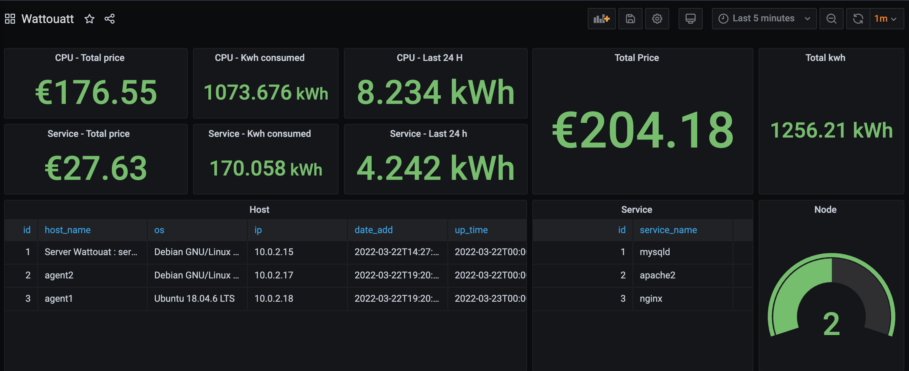

# Wattouat Server

## Table of Contents

- [Stable version](#stable-version)
- [Prerequisites](#prerequisites)
- [Installation](#installation)
- [Database](#access-to-the-database)
- [Command](#command)
- [Interface](#interface)
- [Log file](#log-file)
- [Uninstall Wattouat Server](#uninstall-wattouat-server)

## Stable version

Supported version:

- 
    - [X] Bullseye 
        - Status: Stable
    - [X] Buster
        - Status: Stable
    - [ ] Strech
        - Status: Not tested

- 
    - [X] 21.04 LTS
        - Status: Stable
    - [X] 20.04 LTS
        - Status: Stable
    - [X] 18.04 LTS
        - Status: Stable

## Prerequisites

- Internet connection
- Git
- Root 

## Installation 

### Clone the repositorie

``` shell 
git clone https://github.com/Wattouat-IT/Wattouat-Server.git
```

And go inside the folder Wattouat-Server

### Edit the configuration file

Edit the file ``` wattouat.conf```

 - ip : your local ip who run the database

### Server installation

Executing the script

``` shell 
bash wattouat_server_install.sh
exec bash
```

### Service Wattouat

Launch the service

Start the service at boot time

``` shell 
systemctl enable wattouat_server
```

``` shell 
systemctl start wattouat_server
```

## Access to the database

The name of the database is Elisa.

To see if the data base has been created.

Default user and password is root / root where the database is hosted.

``` shell
mysql -u root -proot elisa
```

Default use user and passwor is admin / root on remote access.

``` shell
mysql -u admin -proot elisa -h <ip_address>
```

See all tables of elisa database

``` mysql
show tables;
```

## Command 

```wattouat_user```: add a new user

## Interface

### Grafana 

Install Grafana on the webserver. See the following instruction https://grafana.com/docs/grafana/latest/installation/

Import our Dashboard which you can find [here](https://grafana.com/grafana/dashboards/15979)



### Website

Access the website

http://<server_ip>/wattouat/

## Defaut user admin

Name and password is ```admin admin```

## Log file 

Go into ```/var/log/wattouat_server/```

There are 2 files: 

First is for Standard Output

Second is for Standard Error

## Uninstall Wattouat Server

Go into ```/bin/wattouat/fonction```

Execute file ```wattouat_uninstall.sh```
